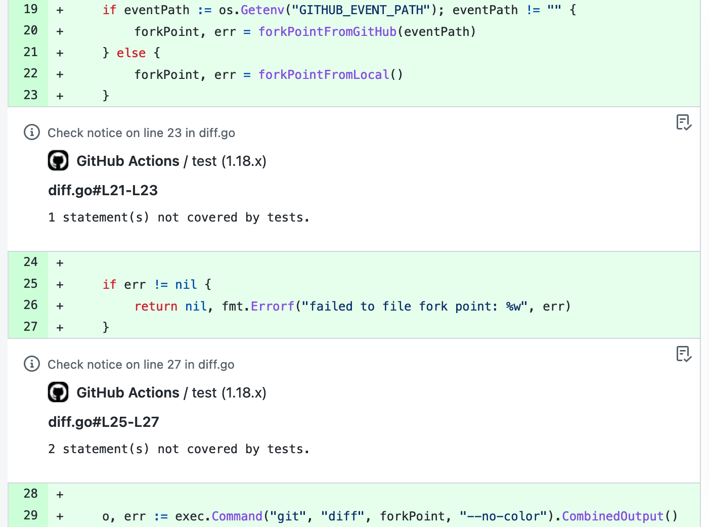
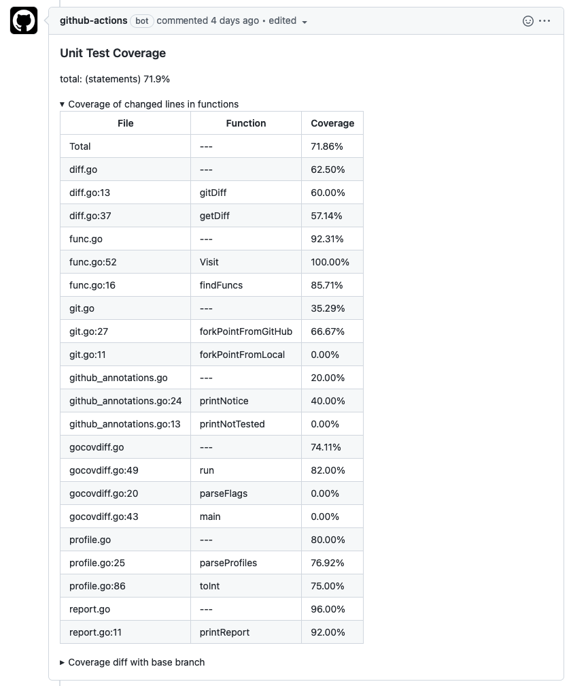

# gocovdiff

[](https://github.com/vearutop/gocovdiff/actions?query=branch%3Amaster+workflow%3Atest-unit)
[](https://codecov.io/gh/vearutop/gocovdiff)

A tool to annotate Go code coverage in GitHub pull requests.

## Install

```
go install github.com/vearutop/gocovdiff@latest
$(go env GOPATH)/bin/gocovdiff --help
```

Or download binary from [releases](https://github.com/vearutop/gocovdiff/releases).

## Usage

```
gocovdiff -help
Usage of gocovdiff:
  -cov string
        Coverage file (default "coverage.txt")
  -diff string
        Git diff file for changes (optional)
  -gha-annotations string
        File to store GitHub Actions annotations
  -mod string
        Module name (optional)
```

## GitHub Action

This tool can produce GitHub Actions annotations to mark changed lines of code that were not covered with tests.



Also, you can comment on the pull request with the report.



```
      - name: Test
        id: test
        run: |
          make test-unit

      - name: Annotate missing test coverage
        id: annotate
        if: ${{ github.event.pull_request.base.sha }}
        run: |
          git fetch origin master ${{ github.event.pull_request.base.sha }}
          curl -sLO https://github.com/vearutop/gocovdiff/releases/download/v1.0.0/linux_amd64.tar.gz && tar xf linux_amd64.tar.gz && echo "<to be filled>  gocovdiff" | shasum -c
          REP=$(./gocovdiff -cov unit.coverprofile -gha-annotations gha-unit.txt)
          REP="${REP//$'\n'/%0A}"
          cat gha-unit.txt
          echo "::set-output name=rep::$REP"

      - name: Comment Test Coverage
        continue-on-error: true
        uses: marocchino/sticky-pull-request-comment@v2
        with:
          GITHUB_TOKEN: ${{ secrets.GITHUB_TOKEN }}
          header: unit-test
          message: |
            ### Unit Test Coverage

            <details><summary>Coverage of changed lines</summary>
            
            ${{ steps.annotate.outputs.rep }}

            </details>
```

## Example 
```
make test && gocovdiff -cov unit.coverprofile
Running unit tests.
ok      github.com/vearutop/gocovdiff   0.738s  coverage: 71.9% of statements
|           File           |      Function       | Coverage |
|--------------------------|---------------------|----------|
| Total                    |                     | 71.86%   |
| diff.go                  |                     | 62.50%   |
| diff.go:13               | gitDiff             | 60.00%   |
| diff.go:37               | getDiff             | 57.14%   |
| func.go                  |                     | 92.31%   |
| func.go:52               | Visit               | 100.00%  |
| func.go:16               | findFuncs           | 85.71%   |
| git.go                   |                     | 35.29%   |
| git.go:11                | forkPointFromLocal  | 75.00%   |
| git.go:27                | forkPointFromGitHub | 0.00%    |
| github_annotations.go    |                     | 20.00%   |
| github_annotations.go:24 | printNotice         | 40.00%   |
| github_annotations.go:13 | printNotTested      | 0.00%    |
| gocovdiff.go             |                     | 74.11%   |
| gocovdiff.go:49          | run                 | 82.00%   |
| gocovdiff.go:20          | parseFlags          | 0.00%    |
| gocovdiff.go:43          | main                | 0.00%    |
| profile.go               |                     | 80.00%   |
| profile.go:25            | parseProfiles       | 76.92%   |
| profile.go:86            | toInt               | 75.00%   |
| report.go                |                     | 96.00%   |
| report.go:11             | printReport         | 92.00%   |

```